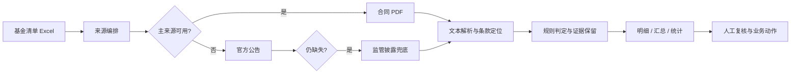

# 基金条款分类 Skill

<p align="center">
  <strong>把分散在上千份基金合同里的清盘条件，转化为可追溯、可复核、可规模化使用的数据产品。</strong>
</p>

<p align="center">
  <a href="#产品命题">产品命题</a> ·
  <a href="#方法论">方法论</a> ·
  <a href="#可信交付">可信交付</a> ·
  <a href="#快速运行">快速运行</a>
</p>

> 面向机构研究、基金运营和风险管理场景的批量条款核验 Skill。它不把 PDF 当作“需要搜索的文件”，而是把合同文本当作可以被解析、定位、判断和审计的结构化信息源。

## 产品命题

基金清盘风险评估的瓶颈，通常不在于“有没有规则”，而在于规则分散在不同版本、不同排版和不同来源的合同与公告中。人工逐份打开文档、定位条款、确认触发条件，再整理成表格，往往需要数周；一旦来源失效、文本解析异常或条款表述发生变化，结果还需要重新核查。

这个 Skill 将一次性项目需求拆解为一条可复用的产品流水线：

```text
批量调取 → 文档解析 → 条款定位 → 规则判定 → 证据溯源 → 结果交付
```

最终交付的不只是“分类结果”，而是一份可以被业务人员复核、被下游系统消费、被下一批任务复用的数据产品。

## 真实交付结果

| 维度 | 结果 |
| --- | --- |
| 覆盖范围 | 首次交付覆盖 1,324 只基金 |
| 自动分类成功率 | 99.9% |
| 效率提升 | 从数周人工评估压缩至小时级 |
| 交付形式 | 基金明细、管理人汇总、统计概览、缓存与证据状态 |
| 复用方式 | 固化为标准化 Skill，可接入后续批量任务 |

## 方法论：把条款变成可计算规则

### 1. 三级来源兜底

来源获取不是单点依赖，而是按照可信度和可用性设计的阶梯：

1. **主来源**：基金合同、数据服务接口及对应 PDF；
2. **业务公告来源**：募集说明书、成立公告、销售公告等官方材料；
3. **监管披露兜底**：公开披露平台中的合同或公告文件。

每一级都会记录请求状态、来源地址和异常原因。主来源不可用时，系统继续向下游切换，而不是让整批任务停在单只基金上。

### 2. 条款结构化

将原文中的自然语言条件抽象为统一判定维度：

- 触发条件：规模、持有人数量、连续期间等；
- 时间口径：工作日、自然日、观察期和会议期；
- 触发机制：备案、召开持有人大会、自动终止；
- 例外与限定：不同基金类型、不同合同版本的特殊表述；
- 证据位置：命中的原文片段、来源和处理状态。

因此，规则层不依赖单一关键词，而是兼容中文数字、阿拉伯数字、不同 PDF 排版和合同版本差异。

### 3. 结果必须可审计

每个分类结论都尽量保留“为什么”：命中的条款片段、来源类型、解析状态和异常信息。对于来源缺失、文本抽取失败或规则冲突的样本，系统标记为待复核，而不是用默认值掩盖不确定性。

## 端到端工作流



## 输出契约

最终 Excel 设计为三个面向不同角色的视图：

- **管理人汇总**：适合观察管理人维度的条款分布和规模化风险队列；
- **基金明细**：适合逐只核验基金代码、名称、条款类型、命中证据和来源状态；
- **统计概览**：适合查看覆盖量、成功率、类型占比和异常样本。

同时生成 `results_cache.json`，记录已经处理的请求与来源结果，支持断点续跑、增量更新和问题复现。

## 代码结构

```text
.
├── SKILL.md                 # 输入输出、边界、运行约束与规则说明
├── scripts/
│   ├── pipeline.py          # 批处理编排、重试与断点恢复
│   ├── classifier.py        # 文本定位、数字归一化与类型判定
│   ├── datayes_api.py       # 主数据来源访问
│   ├── csrc_api.py          # 监管披露兜底访问
│   └── gen_excel.py         # 明细、汇总和统计结果生成
├── requirements.txt
└── README.md
```

## 快速运行

```bash
git clone https://github.com/Marina-016/liquidation-clause-skill.git
cd liquidation-clause-skill
python -m venv .venv
# Windows: .venv\Scripts\activate
# macOS/Linux: source .venv/bin/activate
pip install -r requirements.txt
```

准备包含基金代码、基金名称和管理人等字段的清单后运行：

```bash
python scripts/pipeline.py \
  --input data/fund_list.xlsx \
  --output outputs/liquidation_results.xlsx \
  --token "$DATAYES_TOKEN"
```

也可以通过环境变量提供 `DATAYES_TOKEN`。字段要求、规则边界、来源优先级和重试策略以 [`SKILL.md`](SKILL.md) 为准。

## 产品化价值

- **把一次性交付变成能力模块**：规则、来源和输出契约被固化，后续任务不再从零开始。
- **把“快”建立在可信之上**：三级兜底、原文级溯源和异常标记共同构成质量护栏。
- **把人工从重复劳动转向判断**：机器负责批量检索和初筛，业务人员聚焦冲突样本与最终决策。
- **让结果能够进入下游流程**：结构化明细可以继续用于风险队列、运营跟进和数据服务接口。

## 质量边界与演进

输出结果用于研究筛查和人工复核，不替代法律、合规或基金管理人的正式判断。下一步重点包括：

- 增加 PDF 页码、段落和原文高亮跳转；
- 为规则和样本建立版本号、回归测试与变更记录；
- 引入条款冲突检测，区分来源差异与真实规则差异；
- 将清盘条款与规模、持有人结构、产品生命周期信号合并为可解释的风险队列。

## 数据与安全

基金合同、公告和数据接口受相应服务条款约束。API Token 只能通过环境变量或受控密钥系统管理，不要写入仓库、Excel、日志或截图。
